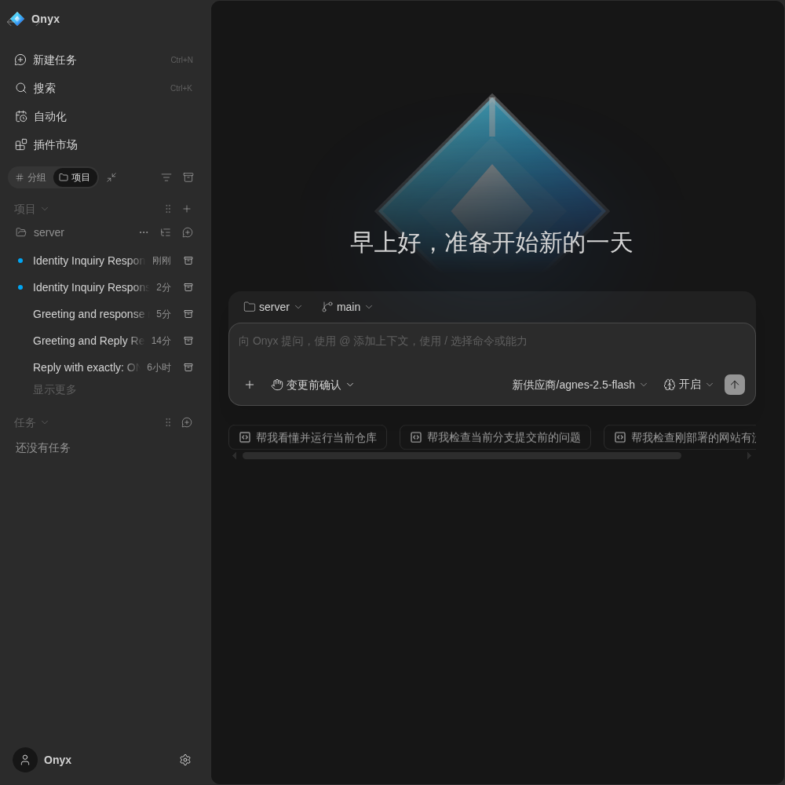
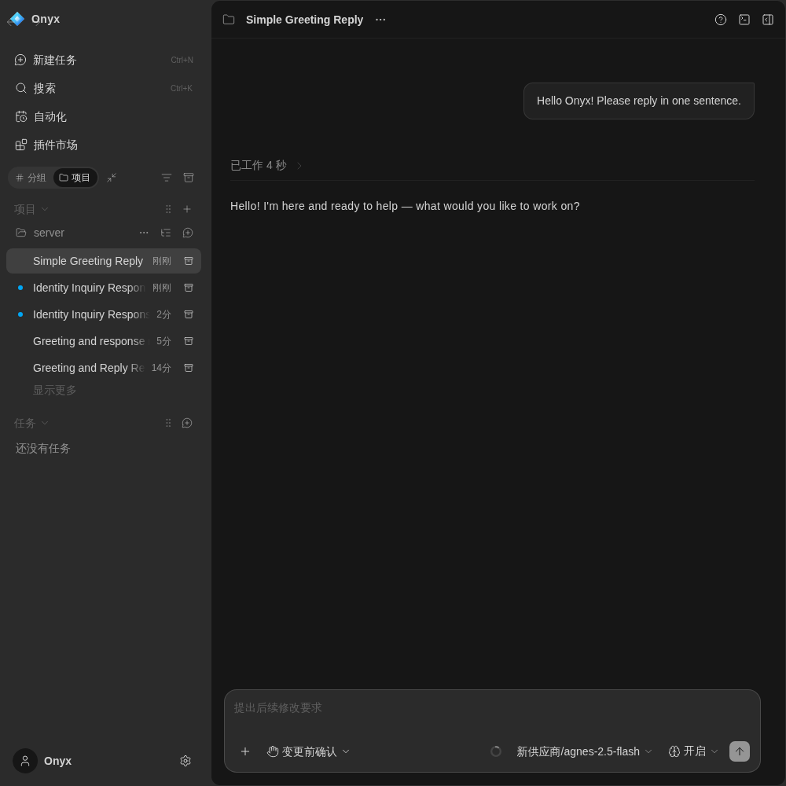
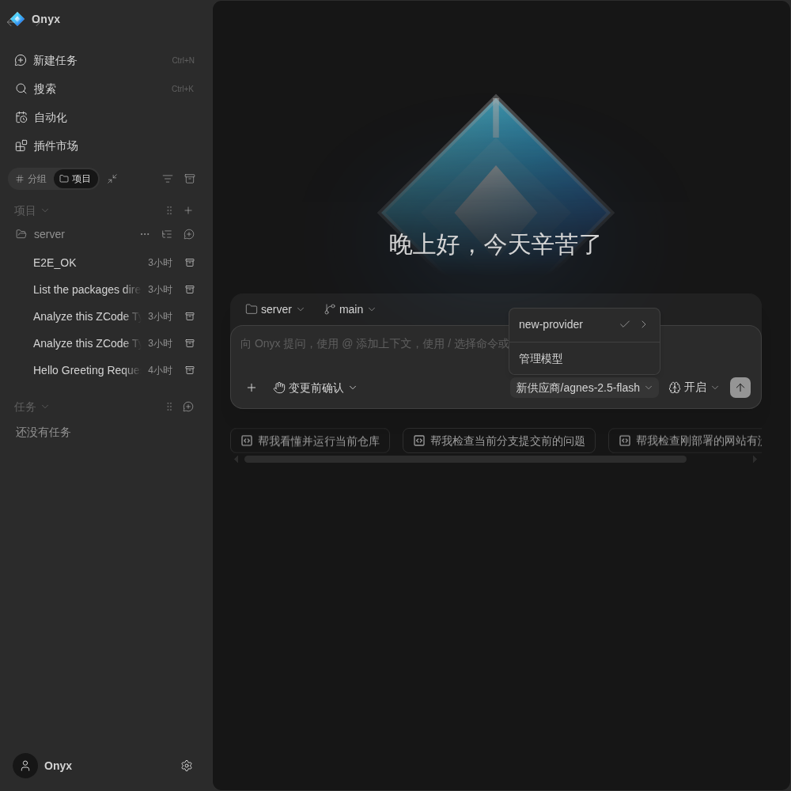

# Onyx · 黑曜石

<div align="center">
  
</div>
<p align="center">
  <strong>属于自己的 AI 编程工作台</strong>
</p>
<p align="center">
  简体中文 | <a href="README.en.md">English</a>
</p>

> Onyx 由 ZCode 深度定制而来：彻底移除官方账号、套餐、订阅与遥测体系，
> 只保留"配一个 API Key 就能开始干活"的纯净体验。打开即是工作台，没有登录墙。

---

## 界面一览

<div align="center">
  
</div>

| 会话与任务 | 模型与配置 |
| --- | --- |
|  |  |

## 它是什么

Onyx 是一个 **AI 编程工作台**，提供浏览器界面与终端 Agent 两种形态：

- **对话式智能体**：在会话里描述需求，Agent 自动思考、查阅仓库、执行命令、产出结果；
- **模型自选**：任意 OpenAI 兼容网关（API Key）即插即用，多模型自由切换；
- **仓库感知**：读取项目结构、文件内容，基于真实代码给出建议；
- **子智能体 / 钩子 / 命令**：为重复工作定义自动化流程；
- **记忆与任务归档**：跨会话记住偏好，任务自动整理归档。

## 快速开始

### 1. 安装依赖

准备 Git、Node.js **24.14.0** 与 pnpm **10.33.2**（版本以 [mise.toml](mise.toml) 为准）：

```bash
pnpm bootstrap
```

`pnpm bootstrap` 安装 workspace 依赖、准备本地运行资源并完成构建。

### 2. 启动

```bash
pnpm dev:web
```

同时启动 Web（默认 `http://localhost:5173`）与后端（默认 `http://localhost:3030`），浏览器打开前者即可。

### 3. 配置 API Key

进入 **设置 → 模型供应商**，添加你的供应商与 API Key（支持任何 OpenAI 兼容网关），在会话输入框顶部选择模型即可开始。

## 开发

```bash
# 桌面版（Electron）
pnpm dev:desktop

# Web 开发（前端 + 后端）
pnpm dev:web

# 质量检查
pnpm lint            # 静态检查（0 warnings 目标）
pnpm typecheck       # 全量类型检查
```

常用环境变量：

| 配置 | 用途 |
| --- | --- |
| `ZCODE_DATA_BASE_DIR` | 应用数据基目录（写入其下 `.zcode/`） |
| `ZCODE_SERVER_WORKSPACE` | Web 后端工作区路径 |
| `ZCODE_BUILTIN_PROVIDER_CONFIG_FILE` | 本地模型供应商配置路径 |

## 已知限制

- **会话内容不持久化**：会话数据存于运行内存，关闭页面或重启服务后，历史会话只剩标题。后续版本将补持久化。
- **模型配额**：模型调用取决于你的 API Key 余额；余额不足时界面会给出明确错误提示。

## 协议

Apache-2.0。第三方组件声明见 [THIRD-PARTY-NOTICES.md](THIRD-PARTY-NOTICES.md)。

---

_Onyx — 打磨每一个细节，为你自己的生产力工具。_
